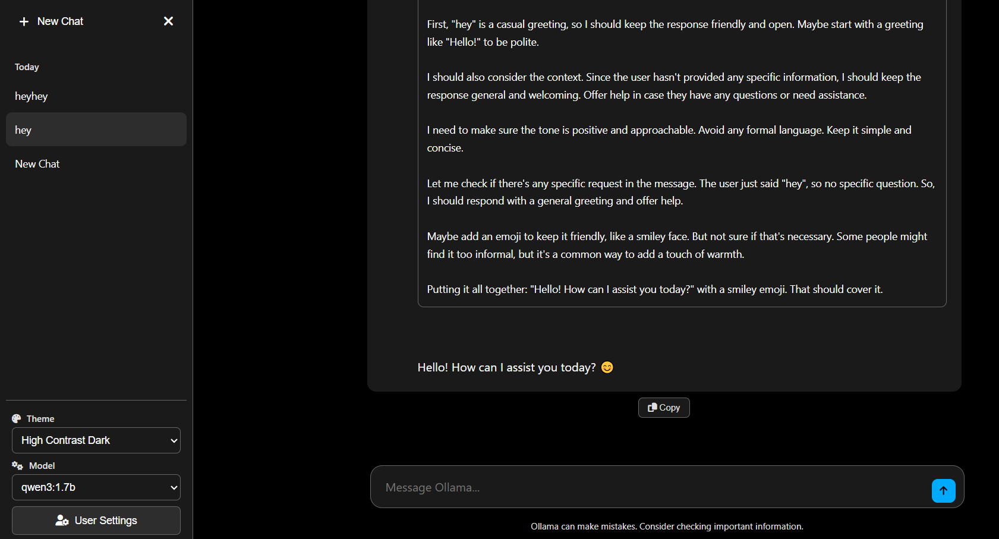

# Ollama Chat Interface



A modern, responsive web-based GUI for Ollama that provides a ChatGPT-like experience with real-time streaming, thinking visualization, and multiple beautiful themes inspired by popular AI chat interfaces.

**Created by [mmdmcy](https://github.com/mmdmcy)**

## ✨ Features

### 🎨 **Beautiful Themes** (Light & Dark variants)
- **Aurora**: Clean, modern interface with green accents 
- **Coral**: Elegant design with deep pink accents 
- **Cosmic**: Sleek interface with purple highlights 
- **Ember**: Warm, professional look with orange accents 
- **High Contrast**: Maximum accessibility with sharp contrasts
- **Odysseus Dark (Default)**: Deep navy dark mode with cyan accents
- **Nebula Dark (New)**: Gradient multi-accent dark theme with depth/elevation

### 🤖 **Advanced AI Integration**
- **Auto Model Detection**: Automatically discovers your installed Ollama models
- **Real-time Streaming**: See responses as they're generated
- **Thinking Visualization**: Live reasoning display with collapsible panel (supports `<think>` / `<thinking>`)
- **Smart Model Management**: Easy switching between available models
- **Model Refresh**: Built-in option to refresh and detect new models
- **Debug Console**: Comprehensive logging for troubleshooting
- **Dev Stats**: Elapsed time, tokens, tokens/sec, timestamp, and model per message
- **Model Capabilities Icons**: 👁️ Vision, 🛠️ Tools, 🤔 Thinking shown inline in the model selector (parsed from `ollama show`)

### 💬 **Chat Management**
- **localStorage History**: Conversations stored securely in your browser
- **Multiple Conversations**: Create and switch between different chats
- **Smart Titles**: Auto-generated chat titles based on first message
- **Chat Deletion**: Easy removal of unwanted conversations with delete buttons
- **Welcome Screen**: Beautiful "Ollama" logo displayed when starting new chats
- **Message Formatting**: Advanced code block detection and formatting
- **Copy Functionality**: One-click copying of messages and code blocks with centered copy buttons
- **Timestamps**: Optional message timestamps
- **Conversation Context Control**: Toggle whether AI remembers previous messages
- **Optimized Spacing**: Reduced spacing between messages for better conversation flow
- **Timeline Navigation (New)**: Right-edge clickable dot/dash timeline to jump to any message

### 📱 **Responsive Design & Customization**
- **Mobile Optimized**: Collapsible sidebar with toggle functionality
- **Desktop Enhanced**: Full sidebar with easy navigation
- **Sidebar Toggle**: Click-away to hide sidebar, toggle button to bring it back
- **Auto-resize Input**: Text area grows with your message
- **Keyboard Shortcuts**: Enter to send, Shift+Enter for new lines
- **User Preferences Panel**: Comprehensive settings for personalization
- **Reading Direction**: Support for left-to-right and right-to-left languages
- **Font Size Options**: Small, medium, and large text sizes
- **Compact Mode**: Condensed view for power users
- **Request Cancellation**: Stop generation mid-stream with abort functionality
- **Smart Auto-Scroll**: Streams only auto-scroll when you’re near the bottom; sending a message jumps to latest

## 🚀 Quick Start

### Prerequisites

1. **Install Ollama**: Download from [ollama.ai](https://ollama.ai)
2. **Pull at least one model**: 
   ```bash
   # Choose models based on your system capabilities
   ollama pull llama3.2:3b     # Good balance of performance/quality
   ollama pull qwen3:1.7b      # Excellent for reasoning tasks, lightweight
   ollama pull mistral:7b      # Larger model for better quality responses
   ollama pull codellama:7b    # Specialized for coding tasks
   
   # Check what you have installed
   ollama list
   ```

### Easy Setup (Windows)

1. **Double-click `start.bat`** - This will:
   - Start a local web server
   - Open the interface in your browser
   - Handle everything automatically

### Easy Setup (Linux Mint / Linux)

1. **Run the launcher**
   ```bash
   cd /home/thorfinn/Documents/GitHub/ollama-chat
   ./start.sh
   ```
   - Opens your default browser to `http://localhost:8000`
   - Starts a local web server (auto-picks the next free port if 8000 is busy)
   - Requires Python 3 (`sudo apt install python3`). If `xdg-open` is available, your browser opens automatically

> Linux Support: The project includes a first-class `start.sh` launcher for Mint/Ubuntu/Debian and most distros. No Node setup required.

### Manual Setup

1. **Start Ollama** (if not already running):
   ```bash
   ollama serve
   ```

2. **Start a local web server**:
   ```bash
   # Python (recommended)
   python -m http.server 8000
   
   # Or with Node.js
   npx http-server -p 8000
   ```

3. **Open in browser**: Navigate to `http://localhost:8000`

## 📁 File Structure & Components

```
wairk/
├── index.html          # Main application structure
├── styles.css          # Complete styling system with themes (incl. Odysseus)
├── script.js           # Core application logic and API integration
├── start.bat           # Windows launcher script
├── start.sh            # Linux Mint/Linux launcher script
├── package.json        # Project metadata
└── README.md           # This documentation
```

### 📄 **index.html**
- **Purpose**: Defines the application structure and layout
- **Key Components**:
  - Collapsible sidebar with chat history and settings
  - Main chat area with responsive header and toggle functionality
  - Input area with auto-resizing textarea and send button
  - Theme and model selectors with refresh capability and capability icons
  - Comprehensive settings modal with user preferences
- **Default Setup**: Starts with Odysseus Dark theme

### 🎨 **styles.css**
- **Purpose**: Complete visual system with CSS variables for theming
- **Architecture**:
  - CSS variables for easy theme switching
  - Theme variants including new Nebula Dark (gradient, multi-accent)
  - Responsive breakpoints for mobile/desktop
  - Animated thinking indicators, collapsible thinking panel, and smooth transitions
  - Advanced message bubble styling with code formatting
- **Key Features**:
  - Smooth animations and hover effects
  - Accessible color contrasts (including high contrast themes)
  - Mobile-first responsive design with sidebar toggle support

### ⚙️ **script.js**
- **Purpose**: Core application logic and functionality
- **Architecture**:
  - Modular function organization with error handling
  - Cached DOM elements for performance optimization
  - State management with localStorage persistence
  - Real-time streaming with AbortController support
- **Key Functions**:
  - `fetchAvailableModels()`: Auto-detects Ollama models with debugging
  - `callOllamaAPI()`: Handles streaming API communication with cancellation
  - `displayMessage()`: Real-time message rendering with code block detection
  - `renderChatHistory()`: localStorage-based conversation management
  - `savePreferences()`: User settings persistence with comprehensive options
  - Theme and preference management with live updates
  - Web Search Tool (optional): DuckDuckGo (no key) and Brave Search API support
  - Model Capabilities parsing: calls `ollama show` (via HTTP) to decorate the model list with 👁️/🛠️/🤔 icons
  - Timeline navigation and auto-scroll logic

### 🚀 **start.bat**
- **Purpose**: One-click launcher for Windows users
- **Functionality**:
  - Starts Python HTTP server on port 8000
  - Opens browser automatically to localhost
  - Provides user-friendly error handling and setup guidance

### 📦 **package.json**
- **Purpose**: Project metadata and dependency information
- **Contents**: Project description, version, and development info

## 🛠 How It Works
## 📎 Attachments & OCR (New)

- Attach files via the paperclip in the input bar (multi-select supported)
- Images are passed to vision-capable models via the `images` array
- Text/Code files are embedded into your prompt as fenced blocks
- PDF/DOCX/PPTX/XLSX/CSV are parsed client-side:
  - PDF text via pdf.js (falls back to OCR if needed)
  - DOCX via Mammoth
  - PPTX via JSZip (extracts slide text)
  - XLS/XLSX via SheetJS (CSV per sheet)
  - Optional OCR via Tesseract (enable in Settings). OCR language: English, Dutch, or both (eng, nld, eng+nld)

> Privacy note: All parsing happens locally in your browser; nothing is uploaded.

## 🌐 Web Search Tool (Optional)

- Enable in Settings → Thinking & Tools
- Engines:
  - DuckDuckGo Instant Answer API (no key)
  - Brave Search API (paste key in Settings)
- Optional CORS proxy field (handy if your browser blocks direct requests)
- During thinking, the model can emit `<search>query</search>` to trigger a search; top results appear above the response

## 🧭 Timeline Navigation (New)

- Right-side mini timeline with dots (you) and dashes (assistant)
- Click any marker to jump to that point in the conversation
- Highlights the nearest marker as you scroll; auto-scroll respects your manual position

## 🔍 Model Capability Icons (New)

- In the model selector, models show capabilities parsed from `ollama show`:
  - 👁️ Vision  ·  🛠️ Tools  ·  🤔 Thinking
- Labels update asynchronously once details are fetched


### 🔄 **Real-time Streaming Process**

1. **User Input**: Message entered and sent via POST to Ollama API
2. **Streaming Response**: API returns chunked data using `stream: true`
3. **Live Parsing**: JavaScript processes chunks in real-time
4. **Thinking Detection**: Looks for `<think>` or `<thinking>` tags
5. **Dynamic Display**: 
   - Thinking content shown with animated dots
   - Main response appears below thinking section
   - Both update live as data streams in
6. **Cancellation Support**: Users can stop generation mid-stream

### 🧠 **Thinking Visualization**

The app intelligently handles models that provide reasoning:

```
User: "What's 2+2?"

[Thinking section with animated dots]
💭 Thinking...
This is a simple arithmetic problem. 
2 + 2 equals 4. Let me double-check: 2 + 2 = 4. Yes, that's correct.

[Response section]
2 + 2 equals 4.
```

### 💾 **Data Persistence**

- **localStorage Storage**: Chat history and preferences stored securely in browser
- **Automatic Saving**: Conversations automatically saved as you chat
- **Cross-session Persistence**: All data survives browser restarts
- **Smart Titles**: First message becomes chat title (truncated to 40 chars)
- **Easy Management**: Delete unwanted conversations with one click

### 🎯 **Auto Model Detection & Debugging**

```javascript
// Fetches from Ollama API with comprehensive logging
GET http://localhost:11434/api/tags

// Console output examples:
🔍 Fetching available models from Ollama...
✅ Successfully loaded 3 models: ['llama3.2:3b', 'qwen3:1.7b', 'mistral:7b']

// Or if there are issues:
❌ Error fetching models: Cannot connect to Ollama - is it running?
```

The interface includes:
- **Status Messages**: Visual feedback on model loading success/failure
- **Refresh Option**: "🔄 Refresh Models" dropdown option to detect new models
- **Smart Selection**: Auto-selects if only one model detected, otherwise prompts user choice
- **No Assumptions**: No fallback models - uses only what you have installed
- **Console Logging**: Detailed debugging information in browser dev tools

## 🎨 Theme Gallery

### **Aurora Themes**
- **Light**: Clean white/green design (modern, professional)
- **Dark**: Modern dark mode with green accents

### **Coral Themes**  
- **Light**: Bright, modern with deep pink highlights
- **Dark**: Dark theme with vibrant pink accents (striking, energetic)

### **Cosmic Themes**
- **Light**: Minimal white with purple details (elegant, spacious)
- **Dark**: Pure black with purple highlights (sleek, focused)

### **Ember Themes**
- **Light**: Warm white with orange accents (friendly, inviting)
- **Dark**: Professional dark with orange highlights (warm, comfortable)

### **High Contrast Themes** (Default)
- **Light**: Maximum contrast with black text on white background
- **Dark**: High contrast dark mode with bright accents for accessibility (Default theme)

## 🛠 User Settings Panel

Access the comprehensive User Settings panel by clicking the "User Settings" button in the sidebar. This allows you to customize:

### **Appearance**
- **Theme Selection**: Choose from 10 beautiful theme variants
- **Font Size**: Small, medium, or large text
- **Reading Direction**: Left-to-right or right-to-left support
- **Compact Mode**: Condensed interface for power users

### **Behavior**
- **Default Model**: Set your preferred Ollama model
- **Show Timestamps**: Toggle message time display
- **Show Thinking Process**: Enable/disable reasoning visualization
- **Auto-save**: Automatic conversation backup (always enabled)
- **Conversation Context**: Toggle whether AI remembers previous messages

### **Data Management**
- **Reset to Defaults**: Restore original settings
- **Clear Chat History**: Remove all conversations
- **Export Settings**: Backup your preferences

All preferences are automatically saved to localStorage and persist across browser sessions.

## ⚙️ Configuration & Customization

### Adding New Models

Models are auto-detected from your Ollama installation. If you install new models:

1. **Install via Ollama**: `ollama pull model-name`
2. **Automatic Detection**: Use the "🔄 Refresh Models" option in the model dropdown
3. **Manual Restart**: Refresh the web page to re-scan for models
4. **Troubleshooting**: Check browser console (F12) for detailed model detection logs

The app only uses models you have actually installed - no assumptions or fallbacks.

### Creating Custom Themes

Add new theme in `styles.css`:

```css
[data-theme="mytheme"] {
    --bg-primary: #your-background;
    --text-primary: #your-text-color;
    --accent-primary: #your-accent;
    --border-color: #your-border;
    --user-message-bg: #your-user-color;
    --assistant-message-bg: #your-assistant-color;
    --button-bg: #your-button-color;
    --button-text: #your-button-text;
    --button-hover-bg: #your-hover-color;
    --main-logo-color: #your-logo-color;
}
```

Then add to both dropdowns in `index.html`:

```html
<!-- In sidebar dropdown -->
<option value="mytheme">My Theme</option>

<!-- In settings modal dropdown -->  
<option value="mytheme">My Theme</option>
```

### Modifying API Settings

Change Ollama endpoint in `script.js`:

```javascript
const response = await fetch('http://your-server:11434/api/chat', {
    // ... configuration
});
```

## 🔧 Troubleshooting

### Common Issues

**❌ "Cannot connect to Ollama - is it running?" message**
- **First, verify Ollama is actually running**: Open terminal and run `ollama list` - you should see your models
- **Check Ollama service**: Run `ollama serve` if needed
- **Test API directly**: Open new terminal and run `curl http://localhost:11434/api/tags` or `Invoke-WebRequest -Uri "http://localhost:11434/api/tags"`
- **Browser Console**: Press F12 → Console tab to see the actual error message
- **CORS Issue**: Make sure you're using `http://localhost:8000/` not opening HTML file directly
- **Port Conflict**: Try a different port if 11434 is blocked: `OLLAMA_HOST=0.0.0.0:11435 ollama serve`

**❌ "🔄 Refresh Models" appears but no models load**
- Same as above - this usually means the API call is failing
- Check browser Network tab (F12 → Network) to see if the request to `/api/tags` is actually being made
- Look for red failed requests or CORS errors

**❌ "No models detected" message**
- Install at least one model: `ollama pull llama3.2:3b`
- Restart Ollama service: `ollama serve`
- Use "🔄 Refresh Models" after installing new models
- Check that Ollama is running on the correct port (11434)

**❌ CORS errors in browser console**
- Use local server (don't open HTML file directly)
- Run `python -m http.server 8000` or similar
- Check browser's developer tools for specific errors

**❌ Thinking visualization not working**
- Ensure your model supports thinking tags (`<think>` or `<thinking>`)
- Test with models like `qwen3:1.7b` which supports reasoning
- Check "Show Thinking Process" is enabled in settings

**❌ Chat history not saving**
- localStorage must be enabled in your browser
- Check if you're in private/incognito mode (localStorage is limited)
- Verify auto-save is enabled in User Settings
- Check browser's developer tools for localStorage errors

**❌ Sidebar won't come back after hiding**
- Look for the hamburger menu (☰) button in the chat header
- The toggle button appears when sidebar is hidden
- Try refreshing the page if toggle button is missing

**❌ Models not detected**
- Check console logs: Open browser dev tools (F12) → Console tab
- Look for model detection messages starting with 🔍, ✅, or ❌
- Use "🔄 Refresh Models" option in model dropdown
- Ensure Ollama API is accessible at localhost:11434

### Browser Compatibility

- ✅ **Chrome/Chromium** (Recommended)
- ✅ **Firefox** 
- ✅ **Safari**
- ✅ **Edge**
- ❌ **Internet Explorer** (Not supported)

### Performance Tips

- Use lightweight models for faster responses (e.g., `llama3.2:3b`, `qwen3:1.7b`)
- Enable compact mode in settings for better performance with long conversations
- Use local server instead of file:// URLs for better performance
- Regularly delete old conversations to keep localStorage clean
- Consider disabling timestamps and thinking display for minimal UI
- Use the stop button to cancel long-running requests

### Debug Mode

Open browser developer tools (F12) to access detailed logging:
- **Model Detection**: See which models are found or why detection fails
- **API Communication**: Monitor streaming responses and errors
- **Storage Operations**: Track localStorage saves and loads
- **Error Details**: Get specific error messages for troubleshooting

## 🤝 Contributing

This project is designed to be easily extensible:

1. **New Themes**: Add CSS variable sets
2. **Features**: Modify `script.js` with new functionality  
3. **UI Improvements**: Enhance `index.html` structure
4. **Bug Reports**: Use GitHub issues

Created and maintained by [mmdmcy](https://github.com/mmdmcy).

## 📄 License

Open source under the MIT License. Feel free to modify and distribute.

---

**Built with ❤️ for the Ollama community by [mmdmcy](https://github.com/mmdmcy)**
